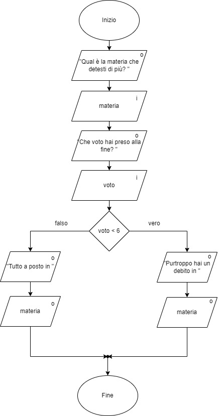

# Voto trimestre
## Descrizione
Realizziamo un programma che chieda in input:
1. La nostra materia peggiore
2. Il voto in quella materia a fine periodo

e ci scriva in output se abbiamo un debito oppure no in quella materia a fine periodo.
## Diagramma di flusso
L'algoritmo che andremo a implementare ha questa forma:

